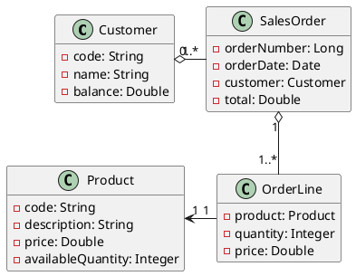

# Sales Order Management System Requirements

## 1. Functional Requirements

2. 1. Manage Customers
   - Create/update customer records with balance tracking
   - Validate customer balance during order creation
2. Manage Products
   - Maintain product inventory with price and quantity
3. Process Sales Orders
   - Create orders with multiple line items
   - Validate product availability
   - Update customer balance and product stock on order completion
4. Exception Handling
   - NotEnoughBalanceException
   - NotEnoughQuantityProductException

## 2. Domain Model

## 3. objects

### Customer

- code: code of customer, used as key to retrieve customer. required, unique. length 11
- name: name of customer. required. length 3 - 50
- balance: volume of money could be used to buy product. required. default value is 0. can not be negative value

### SalesOrder

- orderNumber: auto generated number of order. used as key to retrieve sales order. required, unique.
- orderDate: date to place the order. required.
- customer: customer order make the order. required.
- total: sum of price of all order lines, it's an aggregate value

### OrderLine

- product: required. unique in a single sales order
- quantity: required.
- price: copy from product price, but can be reset to different value

### Product

- code: required. unique. code of product, used as key to retrieve product
- description:
- price: required
- availableQuantity: required. default value is 0, can not be negative value

## 4. use cases

### 4.1 Manage Customers

#### Create New Customer
- Input: customer code, name, initial balance
- Validate customer code uniqueness
- Validate initial balance is non-negative
- Output: created customer details

#### Modify Customer Properties
- Input: customer code, updated fields (name)
- Validate customer exists
- Output: updated customer details

#### Manage Customer Balance
- Increase Balance
  - Input: customer code, amount to add
  - Validate amount is positive
  - Output: updated balance
- Decrease Balance
  - Input: customer code, amount to deduct
  - Validate sufficient balance exists
  - Output: updated balance
- View Balance History - TBD
  - Input: customer code, date range (optional)
  - Output: list of balance changes with timestamps

#### View Customer Information
- Show Customer Detail
  - Input: customer code
  - Output: customer details, current balance, order summary
- Show Customer List
  - Input: search criteria (optional), pagination parameters
  - Output: filtered list of customers with basic info
- Show Customer Orders
  - Input: customer code, date range (optional)
  - Output: list of orders with status and totals

### 4,2 Manage Products

#### Create New Product
- Input: product code, description, initial price, initial quantity
- Validate product code uniqueness
- Validate price and quantity are non-negative
- Output: created product details

#### Modify Product Properties
- Input: product code, updated fields (description)
- Validate product exists
- Output: updated product details

#### Manage Product Pricing
- Adjust Price
  - Input: product code, new price
  - Validate price is non-negative
  - Output: updated product details
- View Price History
  - Input: product code, date range (optional)
  - Output: list of price changes with timestamps

#### Manage Product Inventory
- Increase Quantity
  - Input: product code, quantity to add
  - Validate quantity is positive
  - Output: updated quantity
- Decrease Quantity
  - Input: product code, quantity to remove
  - Validate sufficient quantity exists
  - Output: updated quantity
- View Inventory History
  - Input: product code, date range (optional)
  - Output: list of quantity changes with timestamps

#### View Product Information
- Show Product Detail
  - Input: product code
  - Output: product details, current price, inventory level
- Show Product List
  - Input: search criteria (optional), pagination parameters
  - Output: filtered list of products with basic info

### 4.3 Sales Order

#### Create Sales Order
- Input: customer code
- Validate customer exists and has sufficient balance
- Output: created order number

#### Manage Order Lines
- Add Order Line
  - Input: order number, product code, quantity
  - Validate product exists and has sufficient quantity
  - Calculate line total
  - Output: updated order details
- Modify Order Line
  - Input: order number, line number, new quantity
  - Validate sufficient product quantity
  - Recalculate line total
  - Output: updated order details
- Remove Order Line
  - Input: order number, line number
  - Recalculate order total
  - Output: updated order details

#### Process Order
- Submit Order
  - Validate all lines
  - Check customer balance
  - Check product quantities
  - Update customer balance
  - Update product quantities
  - Output: order confirmation
- Cancel Order
  - Input: order number
  - Restore product quantities
  - Output: cancellation confirmation

#### View Order Information
- Show Order Detail
  - Input: order number
  - Output: order details, customer info, line items
- Show Order List
  - Input: search criteria (optional), date range, pagination parameters
  - Output: filtered list of orders with basic info
- Show Order History
  - Input: order number
  - Output: order status changes with timestamps

### 4.4 New Additional Use Cases

#### Reporting
- Generate Sales Report
  - Input: date range, grouping criteria (product/customer/daily/monthly)
  - Output: sales summary with totals and trends
- Generate Inventory Report
  - Input: date range, threshold parameters
  - Output: inventory levels, movements, alerts
- Generate Customer Activity Report
  - Input: date range, activity types
  - Output: customer transactions and balance changes

#### Audit Trail
- Track Customer Changes
  - Log all modifications to customer records
  - Output: audit trail of changes with user info
- Track Product Changes
  - Log all modifications to product records
  - Output: audit trail of changes with user info
- Track Order Changes
  - Log all modifications to orders
  - Output: audit trail of changes with user info

#### System Administration
- Manage User Access
  - Create/modify user accounts
  - Assign roles and permissions
  - Output: updated user access details
- Configure System Parameters
  - Set business rules
  - Configure notifications
  - Output: updated system configuration

## Exception Handling

### Customer Exceptions
- NotEnoughBalanceException
- CustomerNotFoundException
- DuplicateCustomerCodeException

### Product Exceptions
- NotEnoughQuantityProductException
- ProductNotFoundException
- DuplicateProductCodeException

### Order Exceptions
- InvalidOrderStatusException
- OrderNotFoundException
- EmptyOrderException